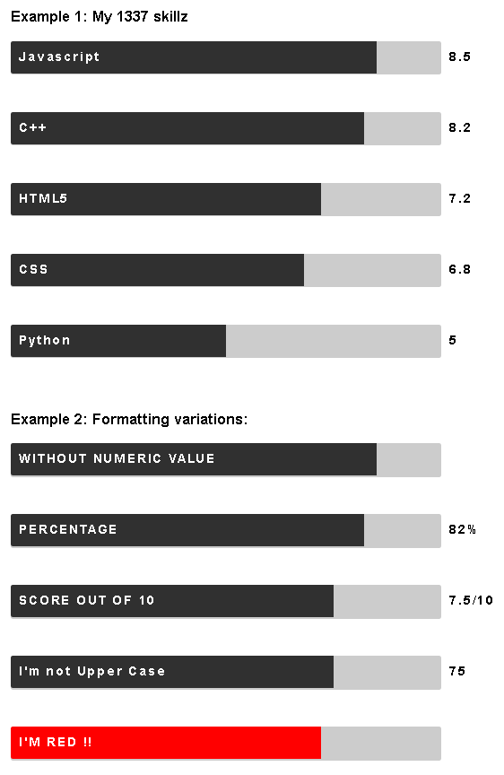

# react-bars
React Component to draw simple "skill bar" - style bar-graphs

This component was developed after needing to graphically display skill levels for various technologies on my resume.

I thought this may be useful to other devs out there, so I turned it into a reusable component for React

Of course, It doesn't need to be used just for "skill bars" - it could fulfil many simple bar graph requirements.

There are two components, in a simple Heirarchy:

- **Bars** draws an entire Bar graph consisting of a number of **Bar** components corresponding to each item in an array of iput data

- **Bar** draws a single Bar component

Each **Bar** inherits properties from the parent **Bars** component, but properties can be overridden for each individual Bar component as required.

Please refer to the API documentation for details:

**API documentation: [./api.md](./api.md)**

### sample usage

    import React, { Component } from 'react';
    import ReactDOM from 'react-dom';	
    import Bars from 'react-bars';

    import './App.css';

    class App extends Component {
      constructor(props) {
        super(props);
        this.state = {
          testData: [
            {label:'Javascript', value:85},
            {label:'C++', value: 82},
            {label:'React', value:80},
            {label:'Node.js', value:75},
            {label:'HTML5', value:72, barColor:'red'},
            {label:'CSS', value:68},
            {label:'JQuery', value:65},
            {label:'Bootstrap', value:60},
            {label:'Python', value:50},
            {label:'Angular.js', value:45},
          ]
        };
      }

      render() {
        return (
          

            <Bars data={this.state.testData} makeUppercase={true}/>
          

        );
      }
    }

    ReactDOM.render(
      <App />,
      document.getElementById('root')
    );

### styling

the styling for the Bars is defined in an internal stylesheet called bar.css

You can override the classes defined in bar.css to meet your own needs:

    .bar-label {
        color: white;
        font: 15px 'opensans-bold', sans-serif;
        letter-spacing: 2px;
        font-weight: bold;
        position: relative;
        top: 10px;
        left: 10px;
    }

    .bar-suffix {
      display: inline-block;
        color: black;
        font: 15px 'opensans-bold', sans-serif;
        letter-spacing: 2px;
        font-weight: bold;
        position: relative;
        top: 10px;
        left: 10px;
    }

    .bar-contain {
        width: 90%;
        padding: 0;
        display: inline-block; 
        border-radius: 3px;
    }

    .bar-expand {
        display: inline-block;
        border-radius: 3px 0 0 3px;
    }

the classes are used as follows:

**bar-label** : the labels inside the bars

**bar-suffix:** the numerical value AND suffix following each bar

**bar-contain:** the surrounding container for each bar

**bar-expand:** the value part of the bar 

_TIP: for a quick-and-dirty VERTICAL bargraph, add **transform: rotate(-90deg);** to the CSS for the enclosing div of a Bars component_

### build commands:

dev: **npm run dev** - runs demo host app to facilitate development

dist: **npm run build** - runs minified build

lint: **npm run lint** - runs ESLint

generate API documentation: **npm run generate-docs**

testing: **npm test**

### to-do: 

* [X] ~~*optional display of numerical value*~~

* [ ] event callbacks (click, hover etc)

* [ ] change orientation (vertical ? etc)

* [X] ~~*document / define styling*~~

* [ ] hover colors etc

* [ ] Auto-color for Labels (consider what happens when value is small ... can't have white-on-white !)

### Acknowledgements / credits:

This project was inspired by the following works:

1. [ceevee template](http://www.styleshout.com/free-templates/ceevee/) (released under the Creative Commons Attribution 3.0 License) by [Styleshout](http://www.styleshout.com/) 

